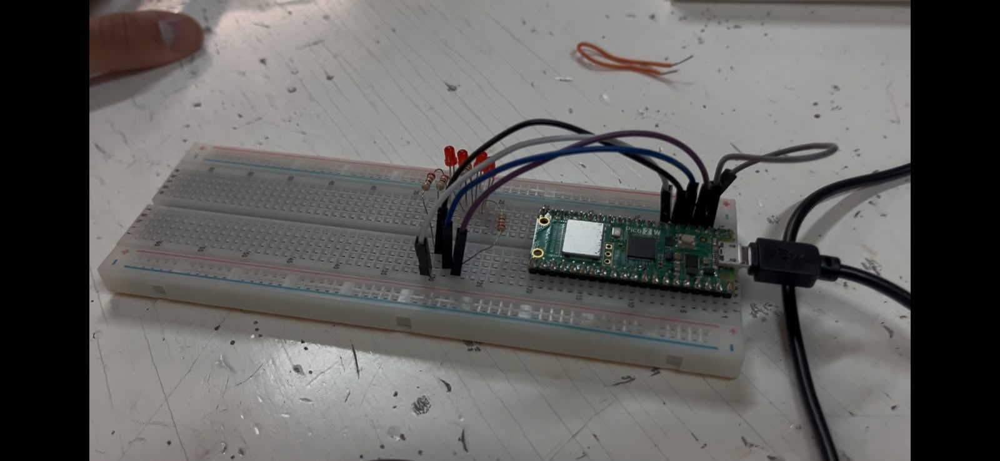

# Session 3 - Implementing custom LED sequences using low-level SIO and bitwise logic

--- 

**Goal:** Implement three distinct dynamic lighting patterns across a 4-LED array by leveraging low-level SIO registers, directional bit-shifts, progressive bitmasks, and compact bitwise sequence processing.

**Prediction:** Dynamic visual sequences like directional bounce, bar filling, and symmetric expansion/contraction can be executed with minimal code footprint by manipulating bit states directly at the register level rather than handling individual pins.

---

## Setup 

- Pin map: 
  - Bit 0: LED A = `GP2`
  - Bit 1: LED B = `GP3`
  - Bit 2: LED C = `GP4`
  - Bit 3: LED D = `GP5`
  - All LED cathodes connected to common ground through current-limiting resistors.

- Photo:
  
*FIgure: is the same setup as in the counter excersice, the hardware logic did not change*

- Non-default: None. Verification was performed through direct visual inspection of the LED sequence timing.

---

## What we did 

1. Configured pins `GP2` through `GP5` as GPIO outputs using SIO register direct configuration (`sio_hw->gpio_oe_set = MASK`).
2. **Sequence 1:** Implemented a walking bit that shifts left (`<<= 1`) or right (`>>= 1`) depending on a direction toggle evaluated at boundary conditions (`1u << PIN_D` and `1u << PIN_A`).
3. **Sequence 2 :** Constructed paired bitwise loops where `(pattern << 1) | 1` feeds trailing ones to fill the bar, and `(pattern << 1) & 0x0F` drains it progressively.
4. **Sequence 3 :** Defined the outer edges (`pattern`) and full mask (`all`), using bitwise XOR (`0b1111 ^ 0b1001`) to generate the inverted inner pair (`pattern2`), cycling symmetrically through edges, full array, center, and blank intervals.
5. Compiled and uploaded the binaries using the `Run` button in VS Code.
6. Verified sequence timing and transitions on the hardware setup.

---

## Evidence

### Sequence 1: 

<video controls width="50%">
  <source src="../recursos/vids/Bouncing_led.mp4" type="video/mp4">
  Your browser does not support the video tag.
</video>
*Figure 1: Single LED scanning back and forth*

### Sequence 2: Progressive Fill & Drain

<video controls width="50%">
  <source src="../recursos/vids/Fill_and_empty.mp4" type="video/mp4">

  Your browser does not support the video tag.
</video>

*Figure 2: Progressive bar accumulator lighting up and clearing sequentially.*

### Sequence 3: Symmetric Inversion

<video controls width="80%">
  <source src="../recursos/vids/Fill_outside.mp4" type="video/mp4">

  Your browser does not support the video tag.
</video>

*Figure 3: Symmetrical center-and-edges expansion and contraction.*

---

## Predicted vs measured

| Routine | Predicted Sequence | Observed Behavior | Step Delay | Status |
|:---|:---|:---|:---:|:---:|
| 1. Ping-Pong Chaser | `0001` -> `0010` -> `0100` -> `1000` -> ... | Continuous scan bouncing at boundaries | 150 ms | Verified |
| 2. Fill & Drain | `0001` -> `0011` -> `0111` -> `1111` -> `1110` -> ... | Progressive bar accumulation and clearing | 200 ms | Verified |
| 3. Symmetric Invert | `1001` -> `1111` -> `0110` -> `0000` -> ... | Symmetrical breathing between edges and center | 150 ms | Verified |

--- 

## What went wrong

- In Sequence 1, checking boundary conditions after executing the shift caused the bit to escape the 4-pin range (`0b10000`), momentarily shutting off all LEDs. Verifying the boundary mask before shifting resolved the issue.

- In the original draft of Sequence 3, individual states were hardcoded via stacked register writes, which made the logic brittle and verbose. Refactoring the cycle into a sequence loop evaluated through bit-shifting reduced redundancy and eliminated visual glitching between steps.

---

## Code

### 1. Directional Bit-Shift Logic

```
int current_led = (1u << PIN_A);
int direction = 1;

while (true) {
    sio_hw->gpio_clr = MASK;
    sio_hw->gpio_set = current_led;
    sleep_ms(150);

    if (current_led == (1u << PIN_D)) {
        direction = -1;
    } else if (current_led == (1u << PIN_A)) {
        direction = 1;
    }

    if (direction == 1) {
        current_led <<= 1;
    } else {
        current_led >>= 1;
    }
}

```
### 2. Bar Fill & Drain Bitwise Logic

```
while (true) {
    // Fill progressively: inserts trailing 1s from LSB
    for (int pattern = 0b0000; pattern < 0b1111; pattern = (pattern << 1) | 1) {
        sio_hw->gpio_clr = MASK;
        sio_hw->gpio_set = pattern << PIN_A;
        sleep_ms(200);
    }

    // Drain progressively: shifts out active bits masked to 4 bits
    for (int pattern = 0b1111; pattern > 0b0000; pattern = (pattern << 1) & 0b1111) {
        sio_hw->gpio_clr = MASK;
        sio_hw->gpio_set = pattern << PIN_A;
        sleep_ms(200);
    }
}

```
### 3. Symmetric Sequence via Bitwise Iteration

```
const int pattern  = 0b1001 << PIN_A;
const int all      = 0b1111 << PIN_A;
const int pattern2 = (0b1111 ^ 0b1001) << PIN_A;

while (true) {
    sio_hw->gpio_clr = MASK;
    sio_hw->gpio_set = pattern;
    sleep_ms(150);

    sio_hw->gpio_clr = MASK;
    sio_hw->gpio_set = all;
    sleep_ms(150);

    sio_hw->gpio_clr = MASK;
    sio_hw->gpio_set = pattern2;
    sleep_ms(150);

//...
}

```

## Open question

- When executing multiple bitwise states sequentially, is there a direct low-level SIO hardware register that can atomically replace the entire GPIO mask state in a single CPU cycle, avoiding the two-step `gpio_clr` followed by `gpio_set` sequence?