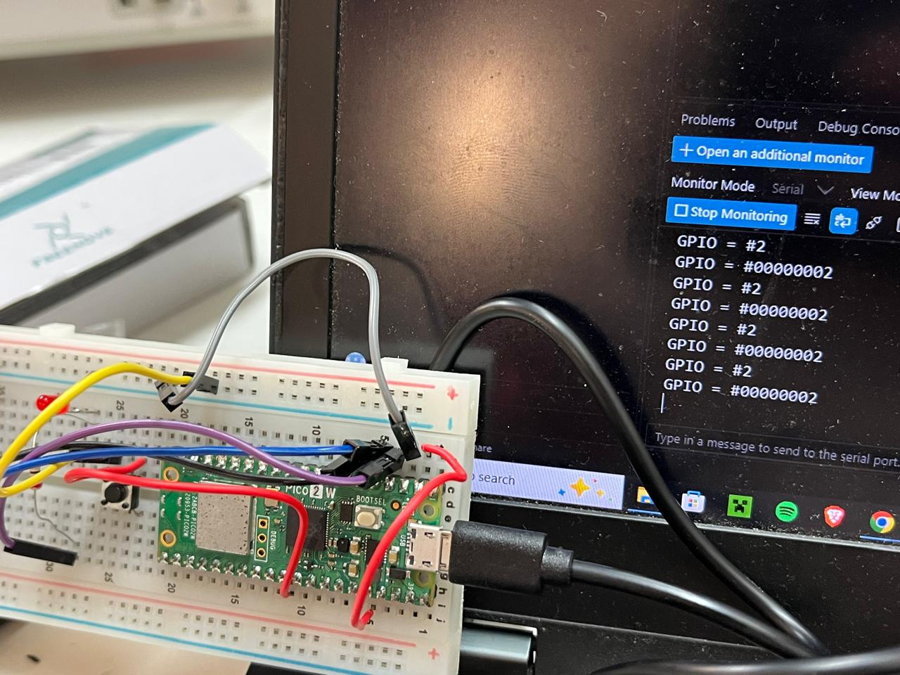
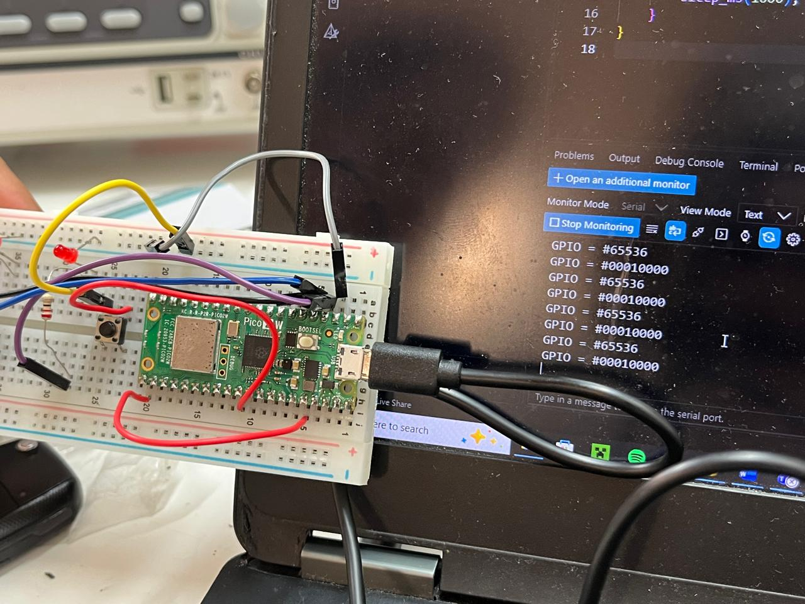
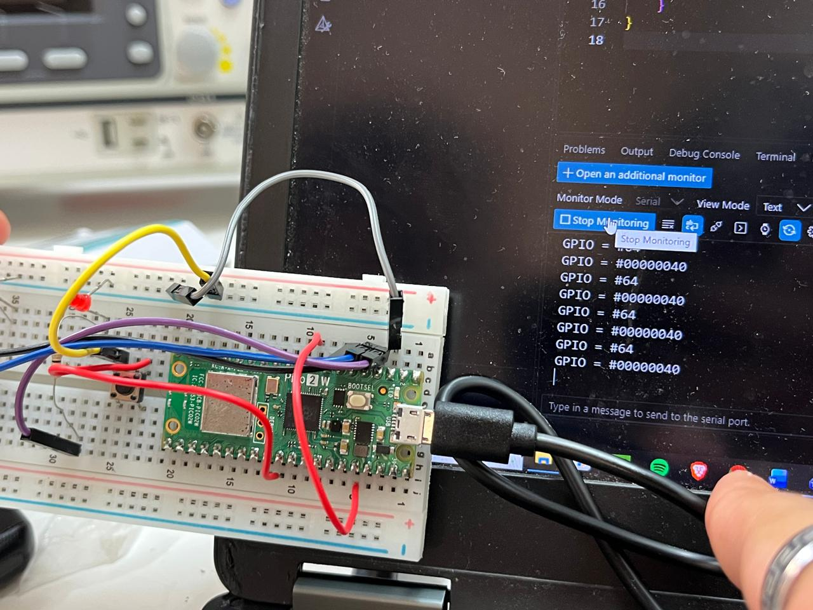

# Session 4 - Digital Inputs and Bitmask Register Inspection via Serial Monitor

--- 

**Goal:** Understand how digital input states are mapped into CPU memory on the Raspberry Pi Pico 2 by reading raw 32-bit SIO input registers through the USB Serial Monitor, observing the decimal values obtained when applying voltage (3.3 V) and grounding pins for reset.

**Prediction:** Since digital GPIOs in the RP2350 SIO architecture are mapped directly to individual bit positions in a 32-bit input register, reading the raw port value when pulling a specific pin HIGH will output a decimal integer corresponding to its exact power of two ($2^{\text{pin}}$). Grounding the pin will clear the bit back to zero.

---

## Setup 

- Pin map:
  - Input test pins: `GPIO1`, `GPIO6`, `GPIO16`.
  - Common rails: 3.3 V (OUT) rail used to energize the target pin; GND rail used to pull it to 0 V for reset.
  - Indicator: Onboard LED (`PICO_DEFAULT_LED_PIN`).

- Non-default:
  - Modified line 45 of `CMakeLists.txt` to enable USB CDC output: `pico_enable_stdio_usb(${PROJECT_NAME} 1)` (changing the parameter from `0` to `1`) so the Serial Monitor in VS Code could display raw text prints.

---

## What we did 

1. Created a new project in VS Code with the Raspberry Pi Pico extension targeting the **Pi Pico 2**.
2. Modified line 45 in `CMakeLists.txt` by placing a `1` on `pico_enable_stdio_usb` to route standard I/O streams directly to the USB connection.
3. Initialized standard I/O via `stdio_init_all()` and configured target GPIO pins as digital inputs (`gpio_set_dir(pin, 0)`).
4. Configured the main loop to continuously sample and print the integer value of the active pin register over the Serial Monitor.
5. Manually applied 3.3 V to each individual pin and subsequently grounded it to observe the decimal value representation and verify register clearing.
6. Monitored the console output in the VS Code Serial Monitor at 115200 baud, recording the resulting decimal values (`2`, `64`, `65536`).

---

## Evidence

### Serial Monitor Register Readings

  

*Figure 1: Photo demonstrating manual voltage assertion on input pins and the corresponding decimal values displayed on the Serial Monitor using GPIO 1 = 2.*

---
  

*Figure 2: Photo demonstrating manual voltage assertion on input pins and the corresponding decimal values displayed on the Serial Monitor using GPIO 16 = 36536.*

---
  

*Figure 3: Photo demonstrating manual voltage assertion on input pins and the corresponding decimal values displayed on the Serial Monitor using GPIO 6 = 64.*

---
## Predicted vs measured

| Tested Pin | Applied State | Predicted Bit | Predicted Decimal ($2^{\text{pin}}$) | Serial Monitor Reading | Status |
|:----------:|:-------------:|:-------------:|:-------------------------------------:|:----------------------:|:------:|
| `GPIO1`    | 3.3 V (HIGH)  | Bit 1         | $2^1 = 2$                             | `2`                    | Verified |
| `GPIO6`    | 3.3 V (HIGH)  | Bit 6         | $2^6 = 64$                            | `64`                   | Verified |
| `GPIO16`   | 3.3 V (HIGH)  | Bit 16        | $2^{16} = 65536$                      | `65536`                | Verified |
| Any Pin    | GND (Reset)   | Bit cleared   | `0`                                   | `0`                    | Verified |

--- 

## What went wrong

- When first opening the Serial Monitor in VS Code, no data was transmitted over the terminal. Standard I/O output in the default template was configured for UART rather than USB CDC. Setting `pico_enable_stdio_usb(${PROJECT_NAME} 1)` in line 45 of `CMakeLists.txt` resolved the communication pipeline.

- If an input pin was left disconnected (floating) without a direct connection to 3.3 V or GND, electrostatic noise caused erratic switching between states. Firmly asserting the pin to the 3.3 V rail and cleanly tying it to GND for reset produced consistent decimal outputs.

---

## Code

    // Initialize pins as inputs
    for (int i = 0; i < 3; i++) {
        gpio_init(PINS[i]);
        gpio_set_dir(PINS[i], 0);
    }

    while (true) {
        // Read raw 32-bit input register from SIO
        uint32_t raw_inputs = sio_hw->gpio_in;

        // Print decimal value directly if any tested pin is high
        if (raw_inputs & ((1u << 1) | (1u << 6) | (1u << 16))) {
            printf("Register Value: %lu\n", (unsigned long)raw_inputs);
            gpio_put(LED, 1);
        } else {
            gpio_put(LED, 0);
        }

        sleep_ms(200);
    }

## Open question

- Since reading the full 32-bit input register returns the raw binary weight `2^ pin` rather than a normalized boolean (0 or 1), is reading the entire register at once computationally preferred when scanning buses or parallel ports compared to invoking individual pin-by-pin `gpio_get()` calls?